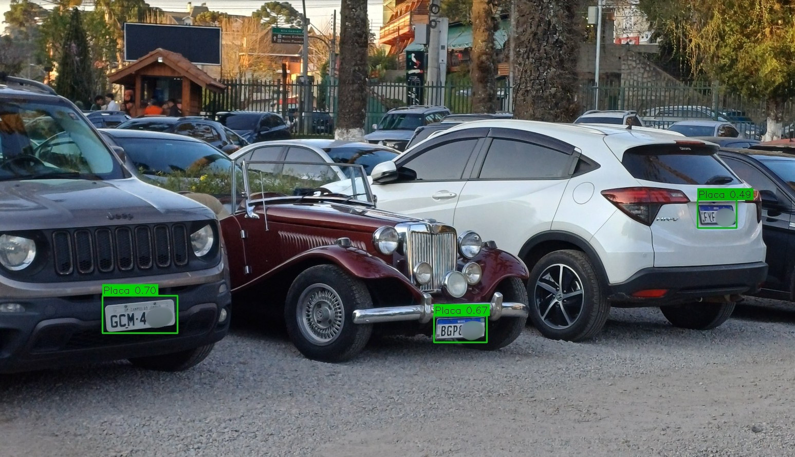
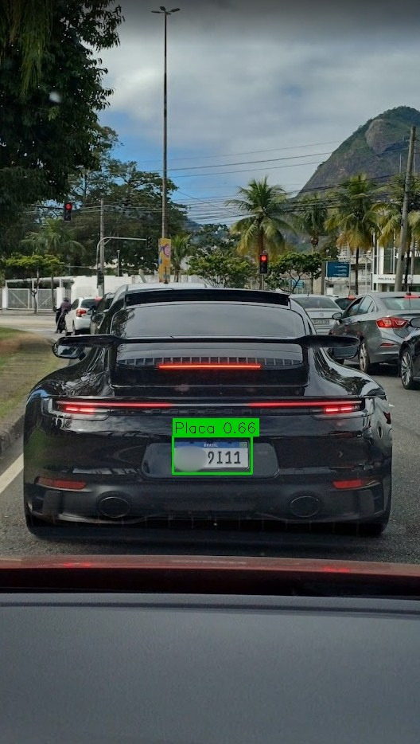
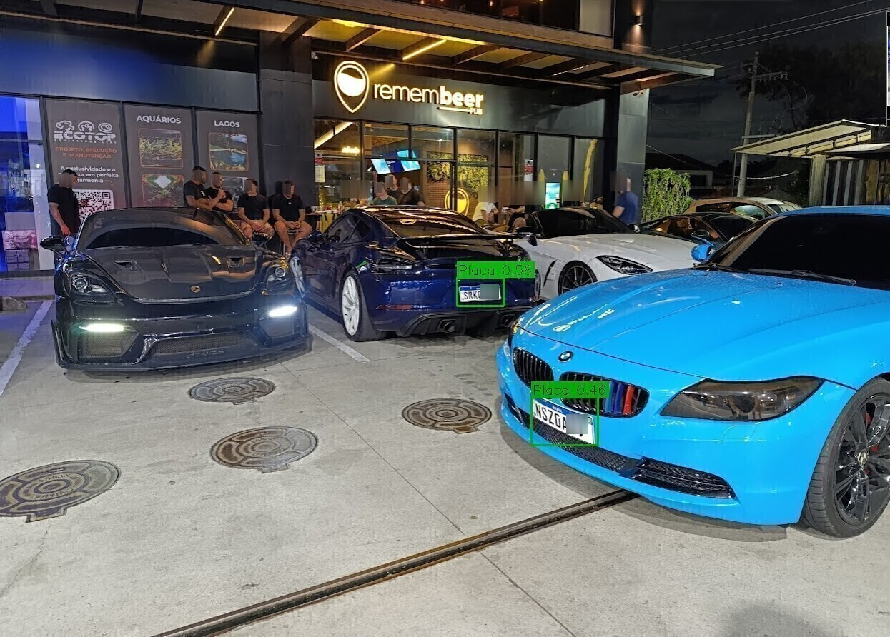
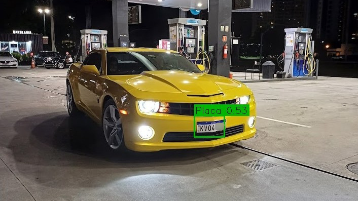

# 🚗 PlateVision


🇧🇷 [Portuguese version -- Versão em Português ](README.pt-BR.md)

---

Real-time **license plate detection system** using **YOLOv8** and **OpenCV**.

---

## 📸 Examples

### Detection in real scenarios

<p align="center">
  
  
  
  
</p>

---

## ✨ Features

* 🔍 License plate detection in **static images**
* 🎮 **Real-time screen capture** (games / streams)
* 💾 Automatic saving of:

  * detected plate crops
  * annotated frames
* ⚡ Optimized for stable execution (CPU/GPU)
* 🧠 Memory management to prevent crashes

## ⚡ Performance

- Real-time processing
- Optimized for low memory usage
- Stable execution using CPU mode

## 📊 Example Output

- Bounding box detection
- Confidence score display
- Automatic crop extraction

---

## 🛠️ Tech Stack

* Python
* YOLOv8 (Ultralytics)
* OpenCV
* NumPy
* MSS (screen capture)

---

## 📦 Installation

```bash
git clone https://github.com/yourusername/PlateVision.git
cd PlateVision
pip install -r requirements.txt
```

---

## 🧠 Model

This project requires a trained YOLO model.

📥 You can download one from:

* Roboflow Universe (search for *license plate detection*)

Then place it here:

```bash
modelos/detector_placas.pt
```

---

## 🚀 Usage

### 📷 Static image

```bash
python platevision.py --imagem imagens_teste/placa1.png
```

---

### 🎮 Real-time screen capture

```bash
python platevision.py --jogo --cpu
```

> ⚠️ Using `--cpu` is recommended for better stability

---

## ⌨️ Controls


|Keyㅤㅤ| Actionㅤㅤㅤㅤㅤㅤㅤ|  
|-------- | -------------------------|  
ㅤQㅤㅤ|ㅤQuit ㅤㅤㅤㅤㅤㅤㅤ  
ㅤSㅤㅤ |ㅤSave current frameㅤ  


---

## 📁 Output folders

* `crops/` → detected plate regions
* `frames_salvos/` → saved annotated frames

---

## 🧪 Tested on

* ✔️ Real vehicle images and videos
* ✔️ Screen capture (e.g., GTA V, YouTube)
* ✔️ Windows 10/11
* ✔️ Python 3.8+

---

## ⚠️ Notes

* Example images may contain **partially anonymized license plates**
* The `.pt` model file is **not included** in this repository

---

## 🔮 Future Improvements

* [ ] OCR for plate reading
* [ ] GUI interface
* [ ] Webcam support
* [ ] API version (Flask / FastAPI)

---

## 🤝 Contributing

Feel free to open issues or submit pull requests.

---

## 📄 License

MIT License

---

## 👨‍💻 Author

Developed by **Maurício Santos**  **-** [LinkedIn](https://www.linkedin.com/in/mauriciosantosc/)

---
