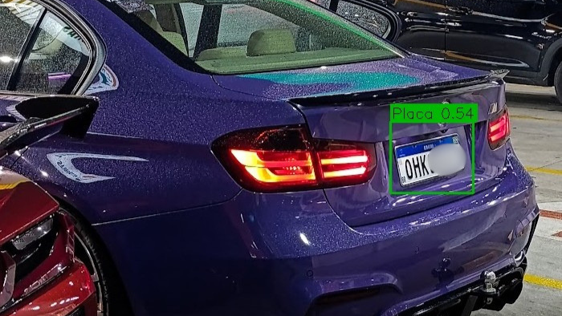

# 🚗 PlateVision


🇺🇸 [English version](README.md)

---

Sistema de **detecção de placas veiculares em tempo real** utilizando **YOLOv8** e **OpenCV**.

---

## 📸 Exemplos

### Detecção em cenários reais

<p align="center">
  
  
  
  
  
</p>

---

## ✨ Funcionalidades

* 🔍 Detecção de placas em **imagens estáticas**
* 🎮 Captura de tela em **tempo real (jogos/streams)**
* 💾 Salvamento automático de:

  * recortes das placas (crops)
  * frames anotados
* ⚡ Execução otimizada (CPU/GPU)
* 🧠 Controle de memória para evitar travamentos

## ⚡ Performance

- Processamento em tempo real
- Otimizado para baixo uso de memória
- Execução estável usando o modo CPU ( --cpu)

## 📊 Exemplo de Saída

- Detecção de caixa delimitadora
- Exibição de pontuação de confiança
- Extração automática de recorte

---

## 🛠️ Tecnologias utilizadas

* Python
* YOLOv8 (Ultralytics)
* OpenCV
* NumPy
* MSS (captura de tela)

---

## 📦 Instalação

```bash
git clone https://github.com/seuusuario/PlateVision.git
cd PlateVision
pip install -r requirements.txt
```

---

## 🧠 Modelo YOLO

Este projeto utiliza um modelo treinado de detecção de placas.

📥 Você pode obter um modelo em:

* Roboflow Universe (busque por *license plate detection*)

Depois, salve em:

```bash
modelos/detector_placas.pt
```

---

## 🚀 Como usar

### 📷 Imagem estática

```bash
python platevision.py --imagem imagens_teste/placa1.png
```

---

### 🎮 Captura de tela (tempo real)

```bash
python platevision.py --jogo --cpu
```

> ⚠️ Recomendado usar `--cpu` para maior estabilidade

---

## ⌨️ Controles

|Teclaㅤㅤ| Açãoㅤㅤㅤㅤㅤㅤㅤ|  
|-------- | -------------------------|  
ㅤQㅤㅤ|ㅤSair ㅤㅤㅤㅤㅤㅤㅤ  
ㅤSㅤㅤ |ㅤSalvar frame atualㅤ  


---

## 📁 Pastas geradas

* `crops/` → recortes das placas detectadas
* `frames_salvos/` → frames anotados salvos

---

## 🧪 Testado em

* ✔️ Imagens e vídeos reais de veículos
* ✔️ Captura de tela (ex: GTA V, YouTube)
* ✔️ Windows 10/11
* ✔️ Python 3.8+

---

## ⚠️ Observações

* As imagens podem conter **placas parcialmente anonimizadas**
* O arquivo `.pt` **não está incluído** no repositório

---

## 🔮 Próximos passos

* [ ] OCR para leitura da placa
* [ ] Interface gráfica (GUI)
* [ ] Suporte a webcam
* [ ] API (Flask ou FastAPI)

---

## 🤝 Contribuição

Sinta-se à vontade para abrir issues ou pull requests.

---

## 📄 Licença

Licença MIT

---

## 👨‍💻 Autor

Desenvolvido por **Maurício Santos**

---
